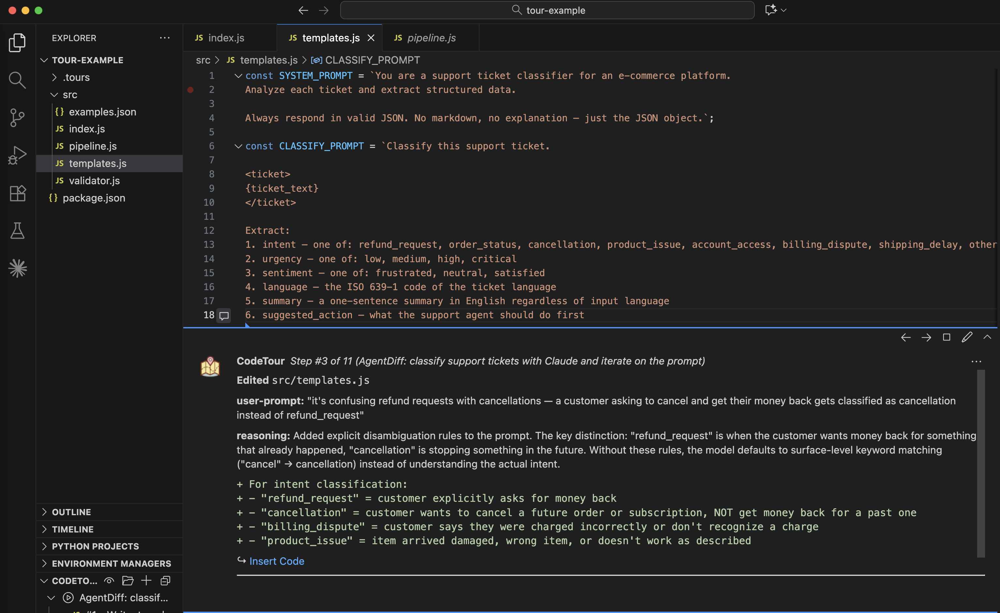

# AgentDiff

**The missing audit trail for AI-generated code.**

AgentDiff is a CLI tool that hooks into Claude Code and tracks every file change with its prompt, reasoning, and task context. Think `git blame`, but for the *why* behind AI-generated code. Works with any language, any codebase.

Point at any line and see who wrote it, agent or human, the prompt that caused it, and the reasoning behind the change. Agent metadata is automatically attached to commits as git notes, so PR reviewers get the full context without leaving `git log`.

## Install

AgentDiff is **language agnostic** — it tracks changes to any file type (Python, TypeScript, Rust, Go, etc.). The tool itself is written in Python for readability, but it works with any codebase.

```bash
curl -fsSL https://raw.githubusercontent.com/sunilmallya/agentdiff/main/install.sh | sh
```

Then initialize in any project directory:

```bash
cd my-project
agentdiff init       # creates .agentdiff/, registers Claude Code hooks, starts daemon
```

That's it. Start coding with Claude Code -- every change is tracked automatically.

```bash
agentdiff teardown   # clean removal when you're done
```

---

## Why

When you vibe code, you lose track. The agent touches 15 files in 30 seconds. You can't tell which lines are yours, why the agent made a specific choice, or if it silently "fixed" something you never asked it to touch.

Git tells you *what* changed. AgentDiff tells you *why*, *who asked for it*, and *whether it was supposed to happen*.

---

```
$ agentdiff blame src/auth.py

     1 | from flask import request, jsonify
     2 | import jwt, os
       -- human / uncommitted / 3m ago
          author: Sunil Mallya

     4 | def login(email, password):
     5 |     user = db.users.find_one({"email": email})
     6 |     if not user or not check_password(password, user["hash"]):
     7 |         return jsonify({"error": "Invalid credentials"}), 401
     8 |     token = jwt.encode({"user_id": str(user["_id"])}, os.environ["SECRET_KEY"])
     9 |     return jsonify({"token": token})
       -- agent / a1f3 / 5m ago (v1, L4-9)
          user-prompt: "add login endpoint with JWT"
          reasoning:   "Implemented email/password login that returns a signed JWT.
                          Uses bcrypt hash check and reads SECRET_KEY from env."

    11 | def require_auth(f):
    12 |     def wrapper(*args, **kwargs):
    13 |         token = request.headers.get("Authorization", "").replace("Bearer ", "")
    14 |         if not token:
    15 |             return jsonify({"error": "Missing token"}), 401
    16 |         try:
    17 |             payload = jwt.decode(token, os.environ["SECRET_KEY"], algorithms=["HS256"])
    18 |         except jwt.InvalidTokenError:
    19 |             return jsonify({"error": "Invalid token"}), 401
    20 |         request.user_id = payload["user_id"]
    21 |         return f(*args, **kwargs)
    22 |     return wrapper
       -- agent / a1f3 / 2m ago (v2, L11-22)
          user-prompt: "add auth middleware to protect routes"
          reasoning:   "Added decorator that extracts and validates JWT from the
                          Authorization header. Attaches user_id to request context
                          so route handlers can access the authenticated user."
```

See how a single line evolved — agent writes, agent refines, human hardens:

```
$ agentdiff blame src/auth.py:17 --history

  17 | jwt.decode(token, SECRET_KEY, algorithms=["HS256"], audience="myapp")

     v3 (latest) -- human / uncommitted / just now
        author: Sunil Mallya
        diff: - jwt.decode(token, SECRET_KEY, algorithms=["HS256"])
              + jwt.decode(token, SECRET_KEY, algorithms=["HS256"], audience="myapp")

     v2 -- agent / a1f3 / 3m ago
        user-prompt: "pin JWT to HS256 only"
        reasoning:   "Restricted to HS256 to prevent algorithm confusion attacks."
        diff: - jwt.decode(token, SECRET_KEY)
              + jwt.decode(token, SECRET_KEY, algorithms=["HS256"])

     v1 -- agent / a1f3 / 8m ago
        user-prompt: "add auth middleware"
        reasoning:   "JWT decode without algorithm restriction."
```

### Human + Agent Iterations

When you edit agent-written code, most tools lose track of who wrote what. AgentDiff doesn't — it attributes each line independently, so inserting or modifying a line doesn't break the surrounding attribution:

```
$ agentdiff blame src/auth.py

     4 | def login(email, password):
     5 |     user = db.users.find_one({"email": email})
     6 |     if not user or not check_password(password, user["hash"]):
     7 |         return jsonify({"error": "Invalid credentials"}), 401
       -- agent / a1f3 / 5m ago (v1, L4-7)
          user-prompt: "add login endpoint with JWT"
          reasoning:   "Implemented email/password login returning a signed JWT."

     8 |     log.info(f"login success: {email}")
       -- human / uncommitted / just now
          author: Sunil Mallya

     9 |     token = jwt.encode({"sub": str(user["_id"])}, SECRET_KEY)
    10 |     return jsonify({"token": token})
       -- agent / a1f3 / 5m ago (v1, L9-10)
          user-prompt: "add login endpoint with JWT"
```

The developer inserted an audit log on line 8. The agent-written lines above and below keep their prompt and reasoning intact.

---

## Commands

```bash
agentdiff blame <file>                   # prompt + reasoning per line (auto-pager)
agentdiff blame <file>:<line> --history  # version history for one line
agentdiff blame <file> --color           # color-coded by prompt
agentdiff blame <file> --json            # JSON output

agentdiff log                            # all changes, newest first
agentdiff log --session=<id>             # filter by session
agentdiff log --file=<path>              # filter by file

agentdiff tour                           # generate VS Code CodeTour walkthrough
agentdiff tour --session=<id>            # tour a specific session
agentdiff tour --file=<path>             # tour changes to one file

agentdiff doctor                         # check daemon, hooks, config
agentdiff relink                         # re-match changes to spec headings
```

---

## Git Notes (automatic)

Every commit gets a git note with the prompts, reasoning, and files the agent touched. This happens automatically via pre-commit and post-commit hooks — no extra steps.

```
$ git log --notes=agentdiff -1

commit a3f1b2c
Author: Sunil Mallya <mallya.16@gmail.com>
Date:   Mon Mar 10 09:09:44 2026 -0700

    add JWT auth

Notes (agentdiff):
    {
      "total_changes": 3,
      "provenance": "agent",
      "prompts": [
        "add login endpoint with JWT",
        "pin JWT to HS256 only"
      ],
      "files": {
        "src/auth.py": {
          "edits": 3,
          "reasoning": [
            "Implemented email/password login returning a signed JWT.",
            "Restricted to HS256 to prevent algorithm confusion attacks."
          ]
        }
      }
    }
```

A PR reviewer sees exactly what was asked, why the agent made each choice, and which files were agent-authored — without leaving `git log`. Notes travel with pushes (`git push origin refs/notes/agentdiff`) and are visible on GitHub via the API.

---

## VS Code CodeTour Integration

Instead of building a custom VS Code extension, AgentDiff generates standard [CodeTour](https://marketplace.visualstudio.com/items?itemName=vsls-contrib.codetour) files — a popular extension used for onboarding and code walkthroughs. `agentdiff tour` produces a `.tour` file that lets you step through every agent change directly in VS Code — with the prompt, reasoning, and diff shown inline at each stop.



**Setup:**

1. Install the CodeTour extension in VS Code:
   ```
   code --install-extension vsls-contrib.codetour
   ```
   Or search "CodeTour" in the Extensions panel.

2. Generate a tour from your agent session:
   ```bash
   agentdiff tour                     # tour all changes
   agentdiff tour --session=<id>      # tour a specific session
   agentdiff tour --file="*.py"       # tour changes to Python files
   ```

3. Open the CodeTour panel in VS Code (explorer sidebar) and click play.

Each step jumps to the exact file and line, showing what the agent did and why.

---

## What Gets Captured

Every time the agent writes or edits a file:

| Field | Source |
|---|---|
| **prompt** | Last user message from the Claude Code transcript |
| **reasoning** | Generated by Claude (haiku) at session end from actual diffs |
| **task** | Claude Code's SubagentStart / TaskCompleted events |
| **spec** | Keyword-matched against `##` headings in your spec markdown |
| **provenance** | `agent` (from hook) or `human` (everything else) |
| **scope** | Files mentioned in the task prompt are in-scope; others are flagged |
| **git info** | Uncommitted human edits detected via `git diff` (author, status) |

**Human edits** are detected automatically. When you modify agent-written code (in your editor, vim, etc.), AgentDiff uses `git diff` to identify which lines you changed. Agent-written lines that you didn't touch keep their original attribution — only the lines you actually modified show as human. In non-git repos, human lines fall back to "no agent change recorded."

---

## How It Works

```
Claude Code                          AgentDiff                        Git

 PostToolUse [Write] --+
 PostToolUse [Edit]  --+  curl -->  Daemon (unix socket)
 SubagentStart       --+---------->   |
 SubagentStop        --+              |-- appends to JSONL       pre-commit:
 TaskCompleted       --+              |                            rollup
 Stop                --+              |-- enriches reasoning     post-commit:
                                      |   via Claude CLI           git note
                                      v
                                   .agentdiff/sessions/
                                     <session_id>/changes.jsonl

Human edits (vim, VS Code, etc.)     agentdiff blame
                                      |-- reads JSONL for agent lines
                                      |-- runs git diff for human lines
                                      |-- difflib matches surviving agent lines
                                      v
                                   per-line attribution (agent or human)
```

**Hooks** are shell scripts that pipe Claude Code event JSON to a local daemon over a unix socket. Under 5ms. Zero dependencies. Fail-open (`|| true`).

**The daemon** is a Python HTTP server (`ThreadingMixIn` + `AF_UNIX`) that appends change records to a per-session JSONL log. At session end, it calls `claude -p` (haiku) to generate reasoning summaries from the actual diffs.

**Git notes** attach agent metadata to commits automatically — see above.

---

## Spec Linking (optional)

Link agent changes to headings in your spec/PRD:

```yaml
# .agentdiff/config.yaml
spec_file: SPEC.md
```

When the agent works on "add JWT authentication," AgentDiff matches against your spec headings and links the change to `## Authentication`. Every change under that task inherits the link. `agentdiff blame` shows it:

```
          spec: SPEC.md -> ## Authentication
```

Run `agentdiff relink` after updating spec headings.

---

## Design Principles

- **Fail open, always.** Hooks end with `|| true`. Daemon errors are logged, never blocking. Git operations are never affected.
- **Invisible performance.** Hook-to-daemon capture is <5ms. The Claude CLI call for reasoning happens once at session end, not per-edit.
- **Session isolation.** Each Claude Code session writes to its own `.agentdiff/sessions/<id>/`. No cross-contamination.
- **Local only.** No network calls during editing. No cloud. No database. Just JSONL on disk.

---

## Requirements

- Python 3.9+ (for the tool itself — your project can be any language)
- [Claude Code](https://claude.ai/code) CLI installed
- Dependencies: `click`, `pyyaml`, `rapidfuzz` (installed automatically)

---

## Roadmap

| Feature              | Notes                                                          | Status  |
|----------------------|----------------------------------------------------------------|---------|
| `blame`              | Per-line prompt, reasoning, and provenance                     | Done    |
| `log`                | Real-time change log, available before commits                 | Done    |
| `doctor`             | Diagnose daemon, hooks, and config health                      | Done    |
| `tour`               | Generate VS Code CodeTour walkthroughs from changes            | Done    |
| Spec linking         | Match changes to `##` headings in your spec/PRD                | Done    |
| Scope flagging       | Detect when the agent edits files outside the task scope       | Done    |
| Reasoning enrichment | Claude-generated summaries from actual diffs                   | Done    |
| Git notes            | Commit-level summaries for PRs and CI                          | Done    |
| Temporal replay      | Step through a session as a timeline of tasks                  | Planned |
| Collision detection  | Alert when two sessions touch the same file                    | Planned |
| Semantic rollback    | Undo a task without disturbing other changes                   | Planned |

---

## License

MIT
